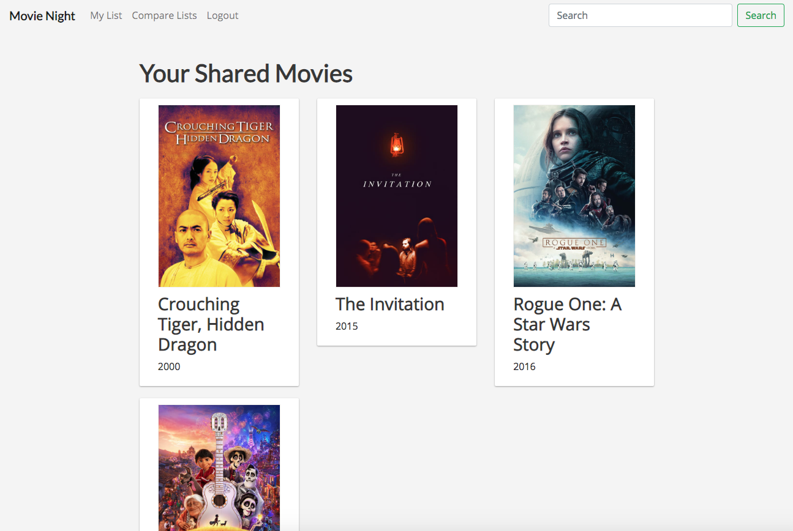
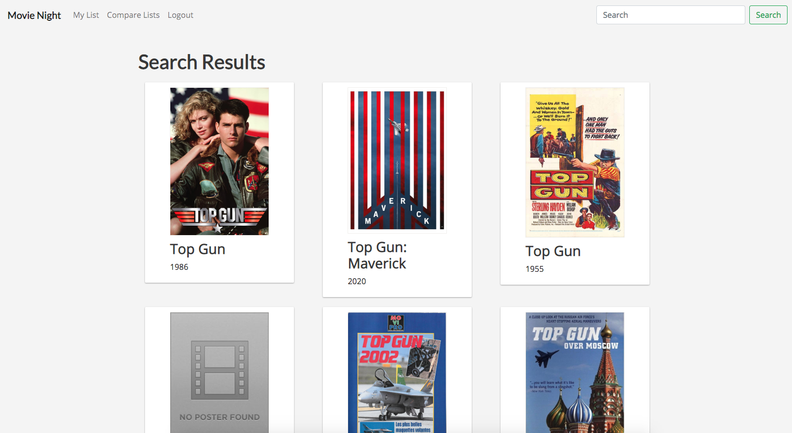
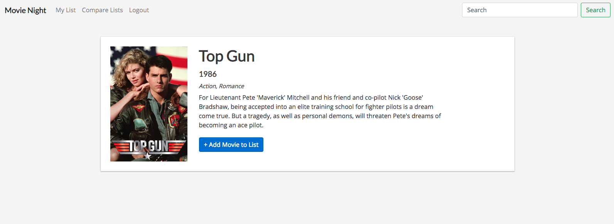
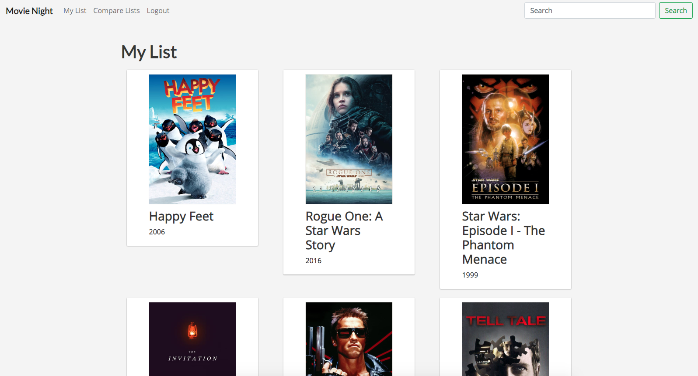
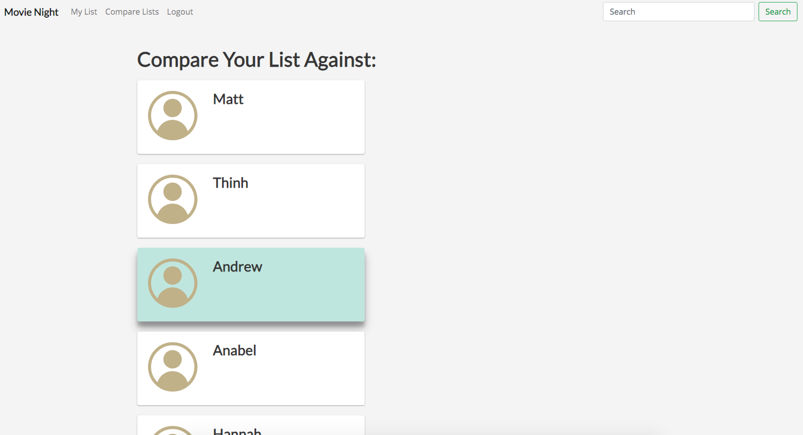

# Movie Night
> Movie Night is a demo app that was submitted as my final project for [Harvard's CS50 course](https://online-learning.harvard.edu/course/cs50-introduction-computer-science).

**Movie Night** solves the ever important problem of trying to find a movie to watch with a group of two or more people.

Movie Night helps you do two things:
1. Keep track of movies you want to watch.
2. Easily find overlapping movies with your friends.



## Installation

### pip requirements
```sh
pip install -r requirements.txt
```

### The Movie DB (TMDb) API
You must have an API key for [The Movie DB's API v3](https://developers.themoviedb.org/3). As per `moviesapi.py`, this must be stored in the environment variable `MOVIE_DB_AUTH`.

### Seeded db
The sqlite3 database `movies.db` is included in the repo with seeded data of users and saved movies.

## Run

To run on a local Flask dev server:
```sh
python -m flask run
```

## Usage

### 1. Keep Track of Movies to Watch
#### Search


#### Add


#### Review your list


### 2. Compare lists with friends

#### Select other users to compare yourself against


#### Review the movies that you have in common with those users


## Acknowledgments
All movie data is accessed from [The Movie DB's API (version 3)](https://developers.themoviedb.org/3).
